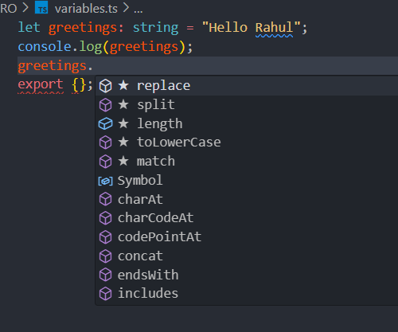
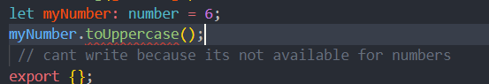
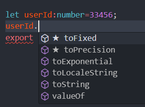
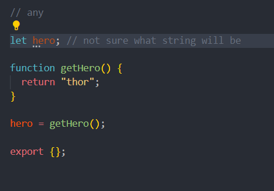

<h2>* String Methods in Javascript:</h2> 

let greetings: string = "Hello Rahul";

console.log(greetings);

-
-

export { }; ----------remove error temporally, (error: cant redeclare let)

↑ string methods

  <h1></h1>

Javascript doesn't have any type for float,int.
Everything is simply numbers

  <h3>* Number</h3>
let userId:number=33456;
also when try to access method tis show methods only related to numbers
 
 let userId=33456.33
userId.toFixed()   
// no need to say its a number in this case
 
its the good practice

userId="abc" //this will give an error as number cannot be assigned to a non numeric value

<h3>* Boolean</h3>
let isLoggedIn: boolean = false;

<h3>* Any ; where to use , and not</h3>
any can take all types of data but it should used carefully because if we assign wrong datatype then
our code may fail or behave unexpectedly.<|im_sep|>

use when you don't want a particular value, typechecking
