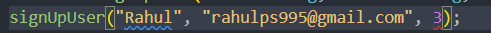

<h2>Function</h2>

in correct way>>

It make sure value comes always number and , use ony that method for numbers

in case of function type annotation is compulsory  
getUpper(2) should be >>>> getUpper("2")

-
- fix one error at one time
  

  after fixing one next
  

  then next
  

 <h2> passing values to function & setting default value</h2>
 some times you don't need to always change this, but  if you  need can
  
  >>>>>

<h3 >return specific<h3/>

show error because it should return number only
correct>>>

function addTwo(num: number): number=(shows return type=number) {

return num + 2;
}

<h2>return type with arrow function</h2>

const greetings=(s:string) :string =>{
return ""
}
 

result

 
<h2>//Array</h2>
 type script automatically identify data type in mapping array 
 *  
 *

1. hero is string

2. here hero is number

can write like this also

heros.map((hero):string=>{
return `hero is ${hero}`
});

<h2>function Return Nothing "void type" </h2>

  
Its says return nothing

<h3> 🟠 never</h3>
<h2 >
 if you want to never return use " never " data type as return  

it means return never observed, this says function throw an exception or terminate the program

</h2>

