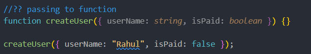
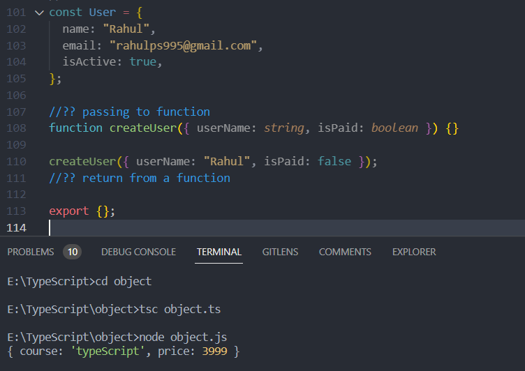
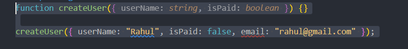
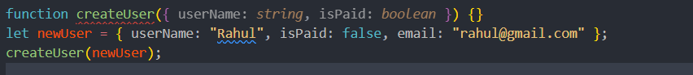
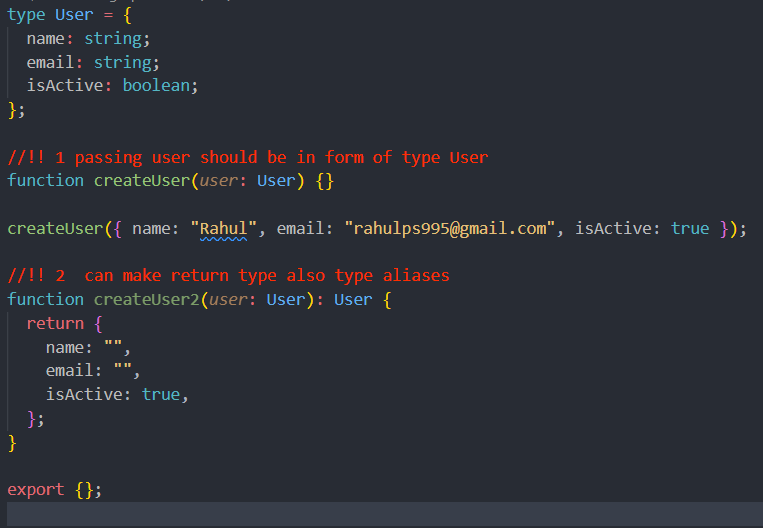
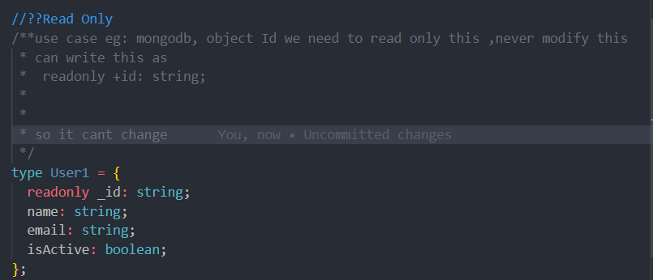
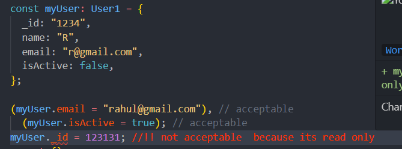
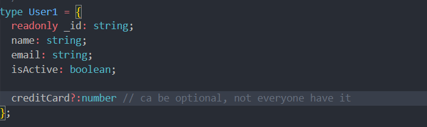
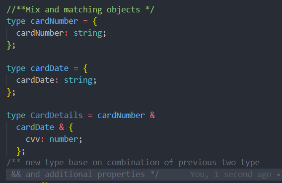

<h2>🟢 Object in typeScript</h2>
 passing to function

return from a function
function createCourse(): {return_type} { function_definition}

//
also can write as
 
function createCourse(): {} {
return { course: "typeScript", price: 3999 };
}
console.log(createCourse());

<h2>💔 bad behavior of Object in typeScript</h2>
function createUser({ userName: string, isPaid: boolean }) {}
 

createUser({ userName: "Rahul", isPaid: false ,
email:"rahul@gmail.com"});

this will not work because the object passed should have only two properties when object is defined and it has three

but
it will work like this

<h1>typeAliases</h1>
if we want to use same property over  multiple location, us type aliases
consider object user, that we use  multiple location, create it with a 
 <h4>"type keyword"</h4>

<h2>Make property Read Only</h2>
 use case eg: mongodb, object Id we need to read only this ,never modify this

<h2>? for optional data</h2>

  <h2>Using already made types two create another new type</h2>

  
  
