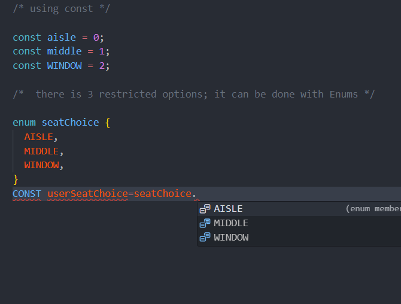
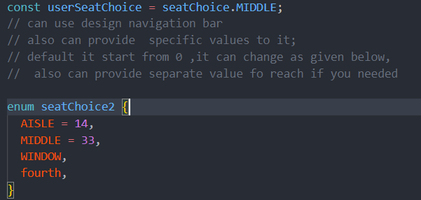
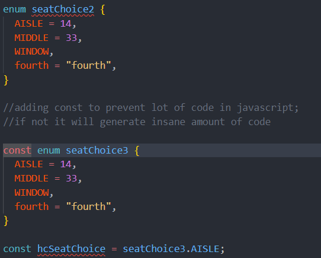
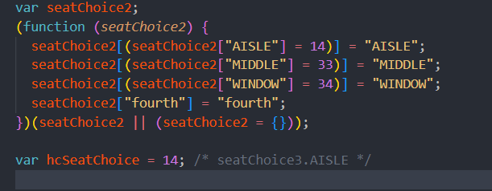

<h1>🔵 Enumbs</h1>

its use when we want to give some restrictions on some values(restrict users choice)  

eg:E-commerce app:= order status :ordered , shipped, delivered. 

plane ticket:= aisle,middle and window (only 3 type of seats)

as you can see now only 3 options are available

 // can use design navigation bar

it this for seatChoice2 a lot of code generated and for seatChoice3 only single line as shows below

