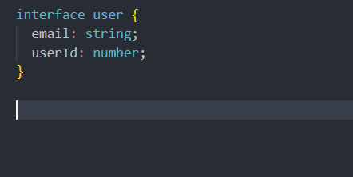
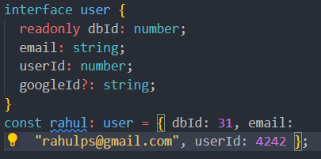
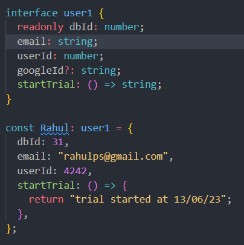
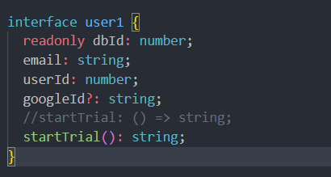
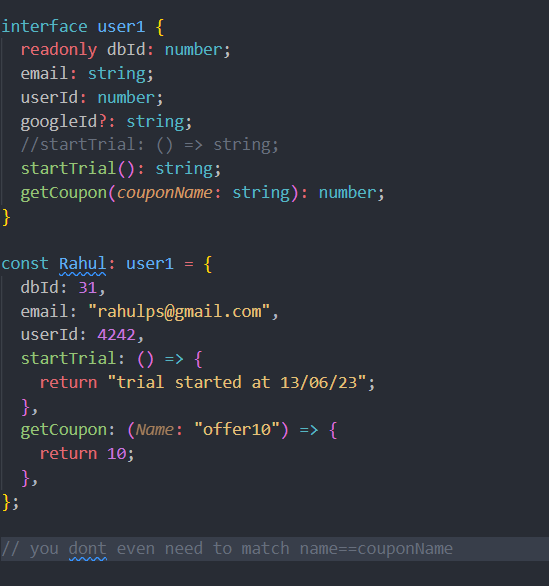

<h1>🟩 Interfaces</h1>

(can easily confused with types)
scenario: creating a new user, user has property like email,password &
database id etc
 
starting service by trial and also some discount for selling

its like when ever you are creating a user it need these thing
  these are things ,methods compulsory, but implementing them up to us; like a class but a loose form of class

adding definition off functions to interfaces

another ay to add definition is

adding coupons

