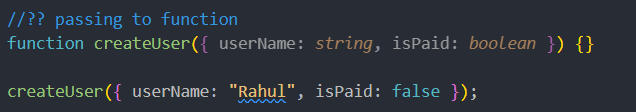
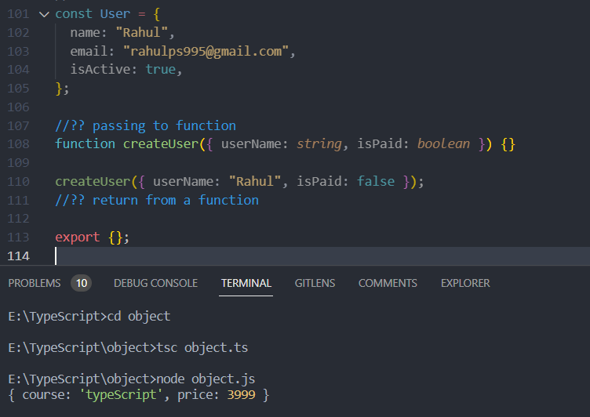
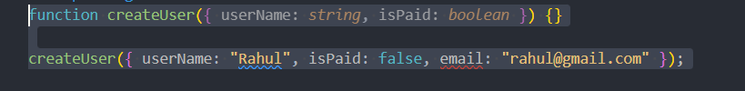

<h2>🟢 Object in typeScript</h2>
 passing to function

return from a function
function createCourse(): {return_type} { function_definition}

//
also can write as
 
function createCourse(): {} {
return { course: "typeScript", price: 3999 };
}
console.log(createCourse());

<h2>💔 bad behavior of Object in typeScript</h2>
function createUser({ userName: string, isPaid: boolean }) {}
 

createUser({ userName: "Rahul", isPaid: false ,
email:"rahul@gmail.com"});

this will not work because the object passed should have only two properties when object is defined and it has three

but
it will work like this

<h1>typeAliases</h1>
